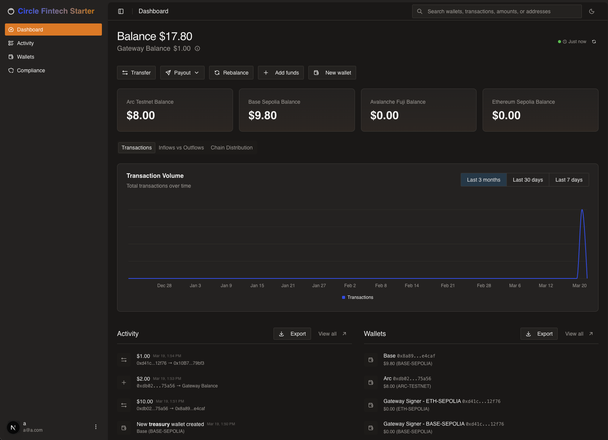

# Arc Fintech Starter App

Modern multi-chain treasury management system. This sample application uses Next.js, Supabase, and Circle Developer Controlled Wallets, Circle Gateway, Circle App Kit, and Circle EarnKit to demonstrate a multi-chain treasury management system with bridge, swap, yield, and compliance capabilities.



## Table of Contents

- [Features](#features)
- [Prerequisites](#prerequisites)
- [Getting Started](#getting-started)
- [How It Works](#how-it-works)
- [Webhooks & Real-Time Updates](#webhooks--real-time-updates)
- [Environment Variables](#environment-variables)
- [User Accounts](#user-accounts)

## Features

The dashboard is organized into a set of pages, each backed by Circle APIs:

- **Treasury overview** (`/dashboard`) — Aggregated multi-chain USDC and EURC balances, including a unified cross-chain balance via Circle Gateway.
- **Wallets** (`/dashboard/wallets`) — Create and manage Developer-Controlled Wallets across supported chains and view per-network USDC/EURC balances.
- **Swap** (`/dashboard/swap`) — Swap USDC ⇄ EURC on Arc Testnet via App Kit (`kit.swap` / `kit.estimateSwap`). Requires a `KIT_KEY`.
- **Earn** (`/dashboard/earn`) — Discover USDC vaults on Arc Testnet with EarnKit, deposit, withdraw, and track positions. (Reward accrual is mocked — see [How It Works](#how-it-works).)
- **Activity** (`/dashboard/activity`) — A unified transaction history spanning transfers, bridges, swaps, and vault operations.
- **Compliance** (`/dashboard/compliance`) — Screen addresses with Circle's Compliance Engine before initiating transfers.

## Prerequisites

- **Node.js v22+** — Install via [nvm](https://github.com/nvm-sh/nvm)
- **Supabase CLI** — Install via `npm install -g supabase` or see [Supabase CLI docs](https://supabase.com/docs/guides/cli/getting-started)
- **Docker Desktop** (only if using the local Supabase path) — [Install Docker Desktop](https://www.docker.com/products/docker-desktop/)
- Circle Developer Controlled Wallets **[API key](https://console.circle.com/signin)** and **[Entity Secret](https://developers.circle.com/wallets/dev-controlled/register-entity-secret)**
- A Circle **Kit Key** — optional for Earn, but **required for Swap** (see [Environment Variables](#environment-variables))

## Getting Started

1. Clone the repository and install dependencies:

   ```bash
   git clone git@github.com:circlefin/arc-fintech.git
   cd arc-fintech
   npm install
   ```

2. Set up environment variables:

   ```bash
   cp .env.example .env.local
   ```

   Then edit `.env.local` and fill in all required values (see [Environment Variables](#environment-variables) section below). For webhook delivery in local development, set `WEBHOOK_ENDPOINT_URL` to your tunnel URL — see [Webhooks & Real-Time Updates](#webhooks--real-time-updates).

3. Set up the database — Choose one of the two paths below:

   <details>
   <summary><strong>Path 1: Local Supabase (Docker)</strong></summary>

   Requires Docker Desktop installed and running.

   ```bash
   npx supabase start
   npx supabase migration up
   ```

   The output of `npx supabase start` will display the Supabase URL and API keys needed for your `.env.local`.

   </details>

   <details>
   <summary><strong>Path 2: Remote Supabase (Cloud)</strong></summary>

   Requires a [Supabase](https://supabase.com/) account and project.

   ```bash
   npx supabase link --project-ref <your-project-ref>
   npx supabase db push
   ```

   Retrieve your project URL and API keys from the Supabase dashboard under **Settings → API**.

   </details>

4. Start the development server:

   ```bash
   npm run dev
   ```

   The app will be available at `http://localhost:3000`.

5. (Optional) Enable webhooks so balances update automatically when funds arrive. See [Webhooks & Real-Time Updates](#webhooks--real-time-updates).

## How It Works

- Built with [Next.js](https://nextjs.org/) App Router and [Supabase](https://supabase.com/)
- Uses [Circle Developer Controlled Wallets](https://developers.circle.com/wallets/dev-controlled) for managing multi-chain transactions
- Uses [Circle Gateway](https://developers.circle.com/gateway) for a unified, cross-chain USDC balance
- Utilizes `@circle-fin/app-kit` for bridging assets across supported chains (`kit.bridge` / `kit.estimateBridge`) and for swapping USDC ⇄ EURC on Arc Testnet (`kit.swap` / `kit.estimateSwap`)
- Uses `@circle-fin/earn-kit` to discover USDC vaults on Arc Testnet, deposit, withdraw, and track positions
- Uses Circle's [Compliance Engine](https://developers.circle.com/w3s/compliance-engine) to screen addresses before transfers
- [Circle webhooks](https://developers.circle.com/api-reference/webhook-endpoints) keep transaction and [Gateway](https://developers.circle.com/gateway/webhooks) state in sync (see [Webhooks & Real-Time Updates](#webhooks--real-time-updates))
- Real-time UI updates powered by Supabase Realtime subscriptions
- Styled with [Tailwind CSS](https://tailwindcss.com) and components from [shadcn/ui](https://ui.shadcn.com/)

> **Earn rewards are mocked.** Vault deposits, withdrawals, and positions are real EarnKit operations, but reward accrual and claiming are faked client-side in `lib/earn/mock-rewards.ts` — Arc Testnet has no live Merkl reward distribution. The module is self-contained and meant to be deleted once real rewards ship.

## Webhooks & Real-Time Updates

The dashboard refreshes balances automatically when funds move: a Circle webhook updates a row in Supabase, and a Supabase Realtime subscription pushes that change to the UI.

Circle must reach your endpoint over the public internet, so local development needs a tunnel (e.g. [ngrok](https://ngrok.com/)). Point a tunnel at your dev server and set `WEBHOOK_ENDPOINT_URL` accordingly:

```bash
ngrok http 3000
```

The app uses two subscriptions (both routed to the same handler): a standard Developer-Controlled Wallets subscription at `/api/circle/webhook` for `transactions.*` events, and a permissionless Gateway subscription at `/api/circle/gateway-webhook` for `gateway.deposit.finalized`. Circle requires a unique endpoint URL per subscription, which is why the Gateway subscription uses a distinct path. New wallet addresses are registered on the Gateway subscription automatically when wallets are created; `npm run webhooks:register` backfills addresses for wallets that already exist.

## Environment Variables

Copy `.env.example` to `.env.local` and fill in the required values:

```bash
# Supabase
NEXT_PUBLIC_SUPABASE_URL=your-project-url
NEXT_PUBLIC_SUPABASE_PUBLISHABLE_KEY=your-publishable-key
SUPABASE_SECRET_KEY=your-secret-key

# Circle
CIRCLE_API_KEY=your-circle-api-key
CIRCLE_ENTITY_SECRET=your-circle-entity-secret

# Circle Kit Key (shared by Earn and Swap; required for Swap)
KIT_KEY=KIT_KEY:<keyId>:<keySecret>

# Webhooks (see "Webhooks & Real-Time Updates" below)
WEBHOOK_ENDPOINT_URL=https://your-ngrok-url/api/circle/webhook
# GATEWAY_WEBHOOK_ENDPOINT_URL=  # optional override; derived from the above if unset

# Arc Testnet RPC (optional)
ARC_TESTNET_RPC_KEY=
```

| Variable | Scope | Purpose |
| --- | --- | --- |
| `NEXT_PUBLIC_SUPABASE_URL` | Public | Supabase project URL. |
| `NEXT_PUBLIC_SUPABASE_PUBLISHABLE_KEY` | Public | Supabase publishable key. |
| `SUPABASE_SECRET_KEY` | Server-side | Supabase secret key for admin operations. |
| `CIRCLE_API_KEY` | Server-side | Circle API key for wallet operations, compliance screening, and webhook subscription management. |
| `CIRCLE_ENTITY_SECRET` | Server-side | Circle entity secret for signing transactions. |
| `KIT_KEY` | Server-side | Circle Kit Key, shared by EarnKit and App Kit Swap. **Optional for Earn** — it runs permissionlessly without one. **Required for Swap** — the Stablecoin Service rejects an empty kit key, so the Swap page will not work without it. Setting it also enables integrator attribution and higher rate limits. Get a free key from the Circle Console. Format: `KIT_KEY:<keyId>:<keySecret>`. |
| `WEBHOOK_ENDPOINT_URL` | Server-side | Public HTTPS URL Circle posts notifications to (e.g. your ngrok tunnel + `/api/circle/webhook`). Used to create/sync the standard and Gateway webhook subscriptions. If unset, falls back to `${NEXT_PUBLIC_APP_URL}/api/circle/webhook` and registration is skipped when neither is set. |
| `GATEWAY_WEBHOOK_ENDPOINT_URL` | Server-side | Optional. Dedicated endpoint for the Gateway *permissionless* subscription. Circle requires a unique URL per subscription, so this must differ from `WEBHOOK_ENDPOINT_URL`. If unset, it is derived by swapping the path to `/api/circle/gateway-webhook`. |
| `NEXT_PUBLIC_APP_URL` | Public | Optional. Base URL of the deployed app, used as a fallback to derive the webhook endpoints when `WEBHOOK_ENDPOINT_URL` / `GATEWAY_WEBHOOK_ENDPOINT_URL` are unset. Not required for local development when `WEBHOOK_ENDPOINT_URL` is set. |
| `ARC_TESTNET_RPC_KEY` | Server-side | Optional. API key for Arc Testnet RPC reads; without it, a rate-limited public RPC is used. |
| `SUPABASE_SERVICE_ROLE_KEY` | Server-side | Only needed by the `npm run webhooks:register` backfill script, which reads wallet addresses directly. The app itself uses `SUPABASE_SECRET_KEY`. |

## User Accounts

### Default Account

On first visit, sign up with any email and password.

## Security & Usage Model

This sample application:
- Assumes testnet usage only
- Handles secrets via environment variables
- Is not intended for production use without modification
